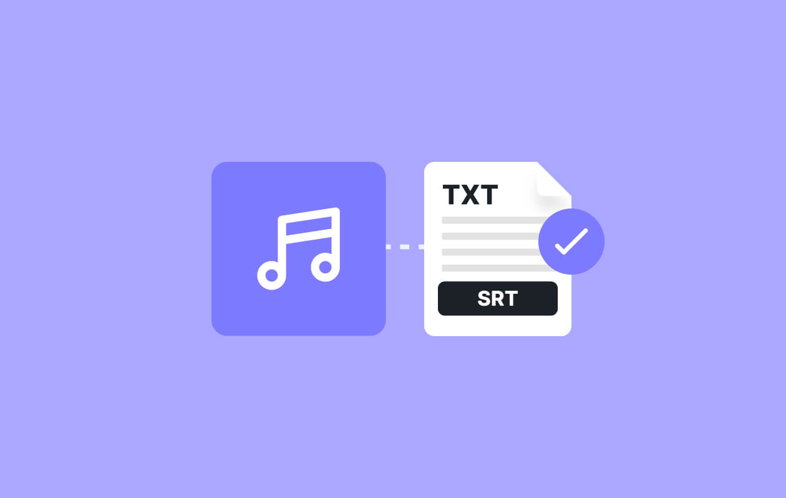

# Transcripter 🎙️


## Overview
Transcripter is an advanced, AI-powered speech-to-text transcription tool designed to handle both live audio and pre-recorded audio files. Leveraging cutting-edge technology, Transcripter provides accurate and efficient transcription services, making it a versatile solution for anyone needing to convert spoken words into text. Whether you're taking notes, recording interviews, or documenting meetings, Transcripter is your go-to tool for seamless transcription.

## Features
- 🗣️ Live Transcription: Real-time conversion of speech to text with high accuracy.
- 🎧 Pre-recorded Audio Transcription: Supports transcription of uploaded audio files (.wav format).
- 🌐 Cross-Platform Compatibility: Access Transcripter from any device with an internet connection.
- 🎨 User-Friendly Interface: Built with Material UI for a clean, modern, and responsive design.
- 🔐 Secure and Private: Your data is handled with the utmost security and privacy.

## Demo
Explore the live demo of Transcripter here.

# Getting Started 👍
## Prerequisites
 - Python 3.8 or higher
 - Virtual environment (venv)

# Installation ⚒️
1. Clone the repository:
 ```
git clone https://github.com/yourusername/transcripter.git
cd transcripter

 ```
 2. Create and activate a virtual environment:
 ```
 python3 -m venv venv
source venv/bin/activate   # On Windows, use `venv\Scripts\activate`
```
3. Install the required dependencies
```
pip install -r requirements.txt
```
4. Run the application
```
flask run
```

# Usage ⭐
## Live Transcription 🤯

- Click on Start Live Transcription to begin real-time transcription.
- The app will capture audio through your microphone and display the text in real-time.

## Pre-recorded Audio Transcription 📕
- Upload your .wav file by clicking on Upload Pre-recorded Audio.
- The app will process the audio file and display the transcribed text.

# Contributing 😊
Contributions are welcome! Please follow the steps below
1. Fork the repository.
2. Create a new branch for your feature or bug fix.
3. Commit your changes and push the branch.
4. Open a Pull Request and describe your changes.

# Contact 📱
For questions or suggestions, please feel free to reach out:
- Email : abdulrahmandev10@gmail.com
- github: github.com/eng-cj


### Transcripter - Transforming voices into text, effortlessly. 🎤✍️

